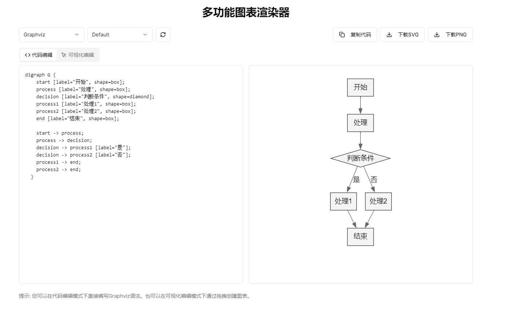

# Flowchart Renderer

## 项目描述

Flowchart Renderer 是一个基于 Next.js 的应用程序，旨在提供一个简单而强大的工具，用于生成和渲染流程图。该项目利用了现代前端技术，支持实时预览和多种自定义选项，适合开发者和设计师使用。

## 特性

- 支持多种流程图格式
- 实时预览功能
- 友好的用户界面
- 可扩展的插件系统

## 使用方法

### 1. 克隆项目

```bash
git clone https://github.com/yourusername/flowchart-renderer.git
cd flowchart-renderer
```

### 2. 安装依赖

使用 npm 安装项目依赖：

```bash
npm install
```

### 3. 启动开发服务器

在开发模式下启动应用：

```bash
npm run dev
```

访问 [http://localhost:3000](http://localhost:3000) 查看应用。

### 4. 构建生产版本

要构建生产版本，请运行：

```bash
npm run build
```

然后使用以下命令启动生产服务器：

```bash
npm start
```

### 5. 使用 Docker

如果你希望使用 Docker 来运行该项目，可以使用以下命令：

```bash
docker-compose down flowchart-renderer-dev
docker-compose up flowchart-renderer-dev
```

这将启动应用并在 [http://localhost:5002](http://localhost:5002) 上提供服务。

## 页面表现



## 贡献

欢迎任何形式的贡献！请提交问题或拉取请求。

## 许可证

该项目使用 MIT 许可证。有关详细信息，请查看 [LICENSE](LICENSE) 文件。